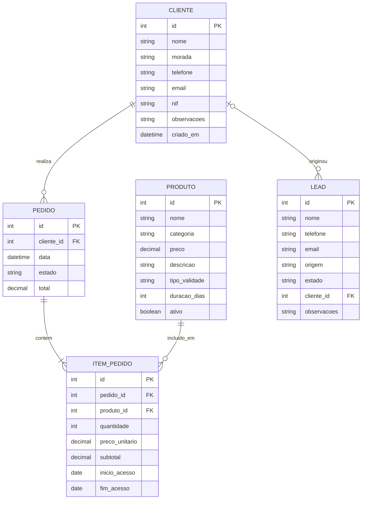

# Diagrama Entidade-Relacionamento (ERD)

## Objetivo

Representar visualmente as entidades do sistema e os seus relacionamentos antes da implementação da base de dados.



## Regra de validade dos produtos

Um produto pode possuir:

### Validade temporária

```text
tipo_validade: TEMPORARIO
duracao_dias: 365
```

O sistema calcula:

```text
fim_acesso = inicio_acesso + duracao_dias
```

### Acesso vitalício

```text
tipo_validade: VITALICIO
duracao_dias: NULL
fim_acesso: NULL
```

As datas efetivas de acesso são armazenadas em `ITEM_PEDIDO`, pois representam a aquisição específica realizada pelo cliente.