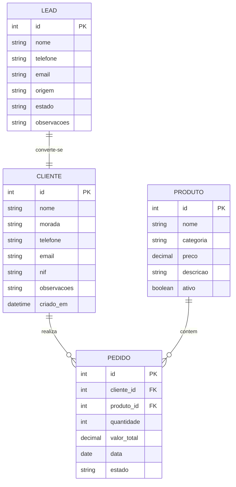

# Diagrama Entidade-Relacionamento (ERD)

# Objetivo

```mermaid
erDiagram

    CLIENTE ||--o{ PEDIDO : realiza
    PRODUTO ||--o{ PEDIDO : contem
    LEAD ||--|| CLIENTE : converte-se

    CLIENTE {
        int id PK
        string nome
        string morada
        string telefone
        string email
        string nif
        string observacoes
        datetime criado_em
    }

    PRODUTO {
        int id PK
        string nome
        string categoria
        decimal preco
        string descricao
        boolean ativo
    }

    PEDIDO {
        int id PK
        int cliente_id FK
        int produto_id FK
        int quantidade
        decimal valor_total
        date data
        string estado
    }

    LEAD {
        int id PK
        string nome
        string telefone
        string email
        string origem
        string estado
        string observacoes
    }
```