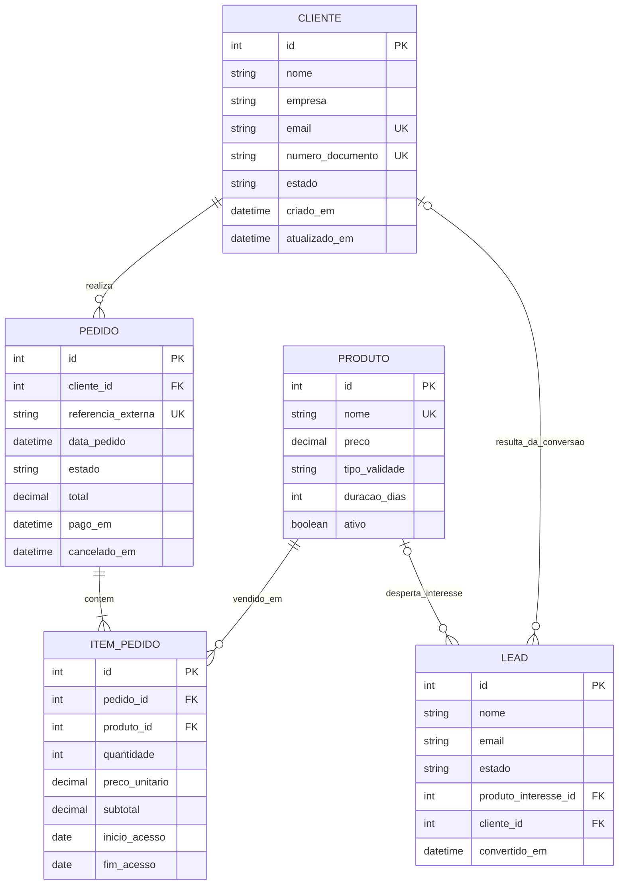

# Diagrama Entidade-Relacionamento

```mermaid
erDiagram
    CLIENTE ||--o{ PEDIDO : realiza
    PEDIDO ||--|{ ITEM_PEDIDO : contem
    PRODUTO ||--o{ ITEM_PEDIDO : vendido_em
    PRODUTO o|--o{ LEAD : desperta_interesse
    CLIENTE o|--o{ LEAD : resulta_da_conversao

    CLIENTE {
        int id PK
        string nome
        string empresa
        string email UK
        string numero_documento UK
        string estado
        datetime criado_em
        datetime atualizado_em
    }

    PRODUTO {
        int id PK
        string nome UK
        decimal preco
        string tipo_validade
        int duracao_dias
        boolean ativo
    }

    PEDIDO {
        int id PK
        int cliente_id FK
        string referencia_externa UK
        datetime data_pedido
        string estado
        decimal total
        datetime pago_em
        datetime cancelado_em
    }

    ITEM_PEDIDO {
        int id PK
        int pedido_id FK
        int produto_id FK
        int quantidade
        decimal preco_unitario
        decimal subtotal
        date inicio_acesso
        date fim_acesso
    }

    LEAD {
        int id PK
        string nome
        string email
        string estado
        int produto_interesse_id FK
        int cliente_id FK
        datetime convertido_em
    }
```

As datas efetivas de acesso ficam em `ITEM_PEDIDO` porque pertencem à aquisição,
e não à definição atual do produto.
